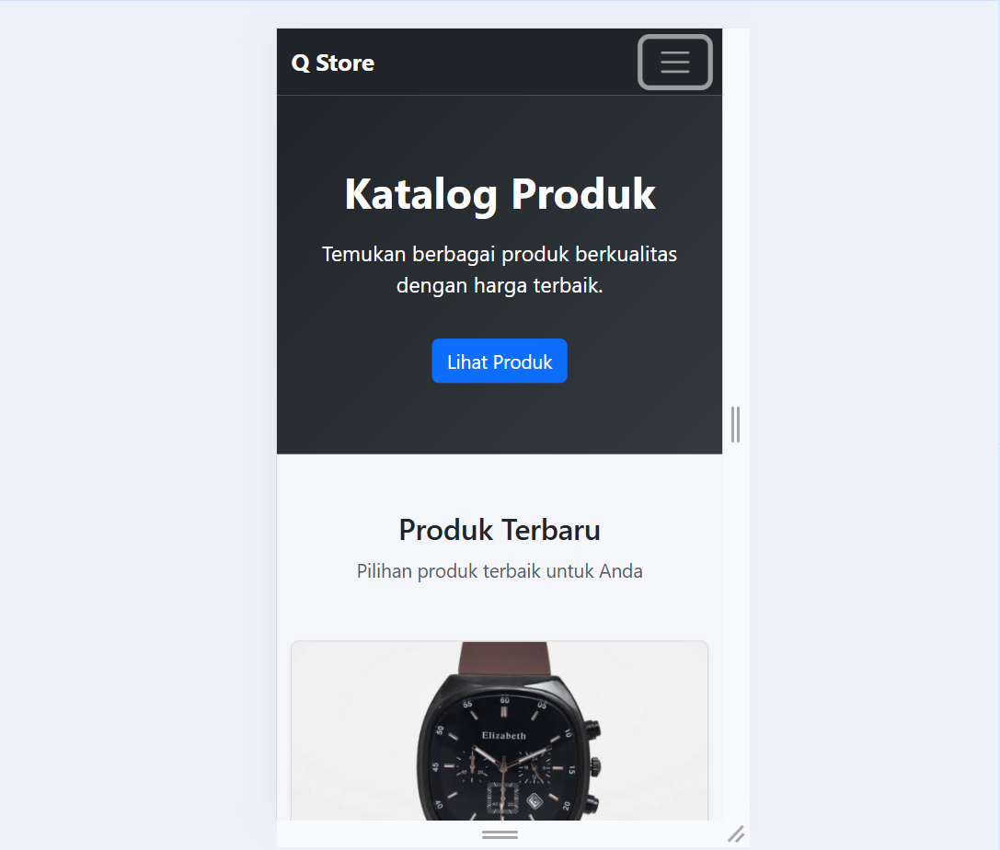

# TugasWeb-Pertemuan3-Katalog

## Deskripsi
Website katalog produk responsif yang dibuat menggunakan **Bootstrap 5**.

## Teknologi
- HTML5
- CSS3
- Bootstrap 5

## Fitur
- Responsive Navbar
- Responsive Grid
- Card Produk
- Responsive Images
- Footer
- Mobile-first Design

## Responsive Testing

### Mobile - 375px

### Tablet - 768px

### Desktop - 1200px

## Repository
**TugasWeb-Pertemuan3-Katalog**

Repository bersifat **Public**.

## Identitas
**Nama:** Muhammad Ariq Lubis  
**Mata Kuliah:** Pemrograman Web  
**Pertemuan:** 3
